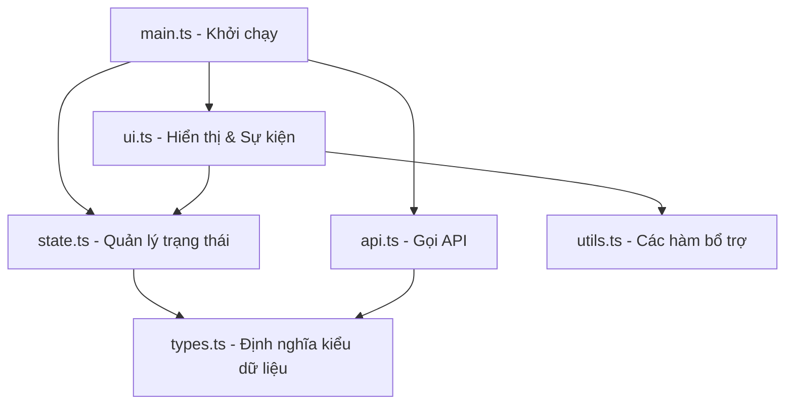

# DevDash — Typed Async Dashboard

Bảng điều khiển (Dashboard) một trang (SPA) hiện đại, giao diện mượt mà theo phong cách **Glassmorphism Dark-theme**. Dự án được xây dựng hoàn toàn bằng **TypeScript (Strict Mode)** và **Vite**, tải dữ liệu bất đồng bộ từ [DummyJSON API](https://dummyjson.com/) với cơ chế quản lý trạng thái tập trung chặt chẽ, an toàn kiểu dữ liệu và tối ưu hiệu năng.

🌐 **Link Demo (Vercel):** [ajt-devdash.vercel.app](https://ajt-devdash-phuc-dq-5-4tz10s8cw-phucduong102503s-projects.vercel.app/)

---

## Tính Năng Nổi Bật (Features)

Dự án được phân cấp rõ ràng theo các tiêu chí đánh giá kỹ thuật:

### 1. Phân Hạng Cơ Bản (Pass Tier — 6.0 Điểm)
- **TypeScript Strict Mode**: Dự án được cấu hình với `"strict": true`, cam kết **không có bất kỳ lỗi cảnh báo hoặc lỗi kiểu dữ liệu nào (zero type errors)**.
- **Định nghĩa kiểu dữ liệu miền (Domain data)**: Toàn bộ dữ liệu từ API được mô hình hóa bằng các `interface` rõ ràng, nói không với việc sử dụng kiểu `any`.
- **Tải danh sách sản phẩm**: Sử dụng cơ chế `async/await` để gọi dữ liệu và hiển thị danh sách sản phẩm trực quan.
- **Chú thích kiểu dữ liệu đầy đủ**: Tất cả các hàm và tham số truyền vào đều được định nghĩa kiểu dữ liệu tường minh.
- **Xử lý lỗi chặt chẽ**: Cơ chế `try/catch` bắt lỗi hệ thống và hiển thị trạng thái lỗi (Error State) thân thiện trực tiếp trên giao diện để người dùng có thể tải lại.
- **Xem chi tiết sản phẩm**: Hiển thị thông tin chi tiết của một sản phẩm qua ID bằng cửa sổ Modal tiện lợi.

### 2. Phân Hạng Khá (Good Tier — 8.0 Điểm)
- **Bộ lọc & Sắp xếp nâng cao**: Tìm kiếm, lọc sản phẩm theo danh mục và sắp xếp theo giá hoặc đánh giá sử dụng các hàm bậc cao (`filter`, `map`, `sort`).
- **Hàm hỗ trợ Generic**: Helper `fetchJson<T>(url: string): Promise<T>` dùng chung cho toàn bộ ứng dụng giúp tái sử dụng mã nguồn hiệu quả.
- **Tải song song (Parallel Fetching)**: Sử dụng `Promise.all` để tải đồng thời sản phẩm và danh mục, tối ưu hóa thời gian phản hồi của trang.
- **Quản lý trạng thái ứng dụng**: Mô hình hóa luồng dữ liệu bằng Union/Literal type đại diện cho các trạng thái: `idle | loading | success | error`.

### 3. Phân Hạng Xuất Sắc (Excellent Tier — 10.0 Điểm)
- **Discriminated Union & Vét cạn**: Quản lý trạng thái thông qua Discriminated Union của `AppState` kết hợp hàm `assertNever` để kiểm tra vét cạn (Exhaustive Checking) ngay tại thời điểm biên dịch.
- **Sử dụng Utility Types tối ưu**: 
  - `Pick` (cho `ProductSummary` rút gọn).
  - `Omit` (cho `ProductDisplayDetails` loại bỏ thông tin kỹ thuật).
  - `Partial` (cho `DashboardDataUpdate` cập nhật trạng thái linh hoạt).
  - `Record` (cho `CategoryMap` tra cứu nhanh danh mục).
- **Generic Cache Manager**: Lớp `CacheManager<T extends Identifiable>` đi kèm ràng buộc kiểu dữ liệu để lưu trữ bộ nhớ đệm chi tiết sản phẩm với thời gian sống (TTL - Time To Live) là 5 phút, tránh gọi API lặp lại.
- **Debounce Search**: Kỹ thuật chống nhiễu (áp dụng Closure) cho ô tìm kiếm giúp giảm tải cho trình duyệt và API.
- **Phân trang Client-side**: Phân trang mượt mà (8 sản phẩm/trang) với bộ điều khiển Prev/Next, tự động đưa về trang 1 khi người dùng thực hiện tìm kiếm hoặc lọc dữ liệu.
- **Kiến trúc Module hóa**: Phân chia rõ ràng giữa các tầng dữ liệu (API), trạng thái (State), giao diện (UI) và tiện ích (Utils).

---

## Công Nghệ Sử Dụng (Tech Stack)

| Công nghệ | Vai trò & Mục đích |
|---|---|
| **TypeScript (Strict)** | Đảm bảo an toàn kiểu dữ liệu, giảm thiểu lỗi runtime |
| **Vite** | Công cụ bundler siêu nhanh và môi trường phát triển cục bộ |
| **Vanilla CSS** | Thiết kế giao diện Glassmorphism dark mode hiện đại, responsive |
| **Fetch API** | Thực hiện các yêu cầu mạng bất đồng bộ |
| **DummyJSON API** | Nguồn cung cấp dữ liệu sản phẩm và danh mục mô phỏng thực tế |

---

## Cấu Trúc Dự Án (Project Structure)

```
ajt-devdash/
├── index.html          # File HTML chính đầu vào
├── package.json        # Định nghĩa dependencies và scripts
├── tsconfig.json       # Cấu hình TypeScript ("strict": true)
├── styles.css          # Hệ thống CSS Glassmorphism dark-theme
├── src/
│   ├── main.ts         # Điểm khởi chạy ứng dụng, khởi tạo trạng thái và lắng nghe render
│   ├── types.ts        # Định nghĩa toàn bộ interfaces, union types và utility types
│   ├── api.ts          # Hàm fetchJson<T> generic và các hàm gọi API
│   ├── state.ts        # Quản lý trạng thái tập trung (Centralized State)
│   ├── ui.ts           # Logic render giao diện, xử lý sự kiện và phân trang
│   └── utils.ts        # Các hàm tiện ích: debounce, CacheManager, assertNever
└── README.md           # Hướng dẫn dự án
```

### Sơ đồ luồng dữ liệu (Data Flow)



---

## Hướng Dẫn Cài Đặt và Khởi Chạy (Getting Started)

### Yêu cầu hệ thống
- **Node.js** (Khuyến nghị phiên bản v18 trở lên)
- **npm** (Đi kèm khi cài đặt Node.js)

### Bước 1: Cài đặt các thư viện phụ thuộc
Mở thư mục dự án trong terminal và chạy lệnh:
```bash
npm install
```

### Bước 2: Chạy máy chủ phát triển (Development Server)
Khởi động dự án ở môi trường local:
```bash
npm run dev
```
Sau đó truy cập địa chỉ hiển thị trên terminal (thường là [http://localhost:5173](http://localhost:5173)) bằng trình duyệt.

### Bước 3: Đóng gói ứng dụng (Production Build)
Biên dịch dự án sang mã nguồn thuần tối ưu hóa (HTML/CSS/JS) để triển khai thực tế:
```bash
npm run build
```
Mã nguồn sau khi build sẽ nằm trong thư mục `dist/`.

### Bước 4: Xem trước bản Build
Để chạy thử bản đã build trên local:
```bash
npm run preview
```

---

##  Triển khai (Deployment)

Dự án đã được triển khai thành công trên **Vercel**:
- **Link Live Demo:** [DevDash on Vercel](https://ajt-devdash-phuc-dq-5-4tz10s8cw-phucduong102503s-projects.vercel.app/)

---

## Điểm Nhấn Kỹ Thuật (Technical Highlights)

1. **Generic Helper `fetchJson<T>`**: Sử dụng tham số kiểu `<T>` để tự động cast dữ liệu trả về từ JSON sang kiểu dữ liệu TypeScript mong muốn tại chỗ gọi hàm, tăng độ an toàn và gợi ý code (IntelliSense).
2. **Discriminated Union `AppState`**: Hợp nhất các trạng thái ứng dụng dưới một nhãn `status` duy nhất. Việc thu hẹp kiểu (Type Narrowing) thông qua lệnh `switch (state.status)` giúp ngăn ngừa việc truy cập các biến không tồn tại ở trạng thái hiện tại.
3. **Exhaustive Checking**: Sử dụng kiểu dữ liệu đặc biệt `never` thông qua hàm `assertNever(state)` ở nhánh `default` của `switch-case`. Giúp phát hiện lập tức các trạng thái mới chưa được xử lý tại thời điểm viết code.
4. **Cache Manager (TTL 5 phút)**: Lớp lưu trữ cache hướng đối tượng sử dụng cấu trúc dữ liệu `Map`, tự động kiểm tra thời gian sống (Time-To-Live) của dữ liệu. Nếu dữ liệu còn hạn, ứng dụng hiển thị ngay lập tức mà không cần gửi lại request API.
5. **Debounce Closure**: Sử dụng Closure để lưu lại bộ đếm thời gian `timer`. Khi người dùng gõ tìm kiếm liên tục, bộ đếm cũ sẽ bị xóa và thiết lập lại bộ đếm mới. Hàm tìm kiếm thực tế chỉ được thực thi sau khi người dùng dừng gõ 350ms, tiết kiệm tài nguyên mạng và cải thiện trải nghiệm người dùng.

---

